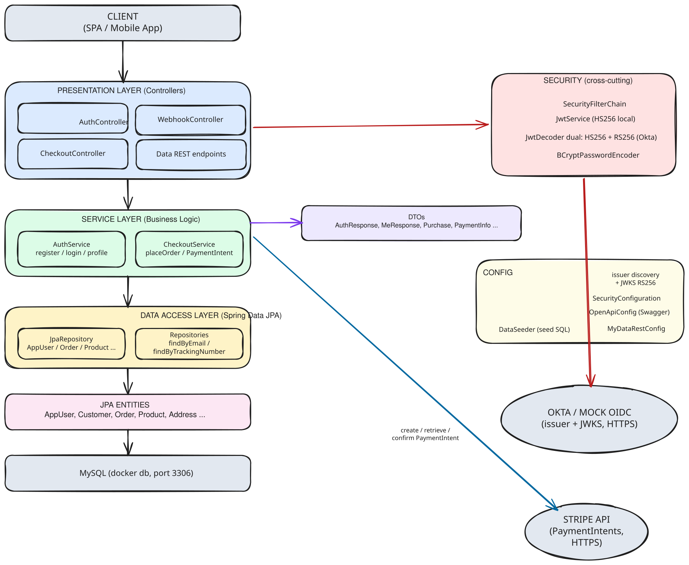
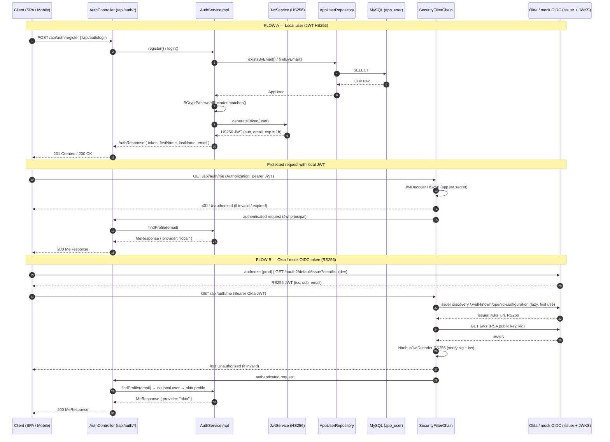
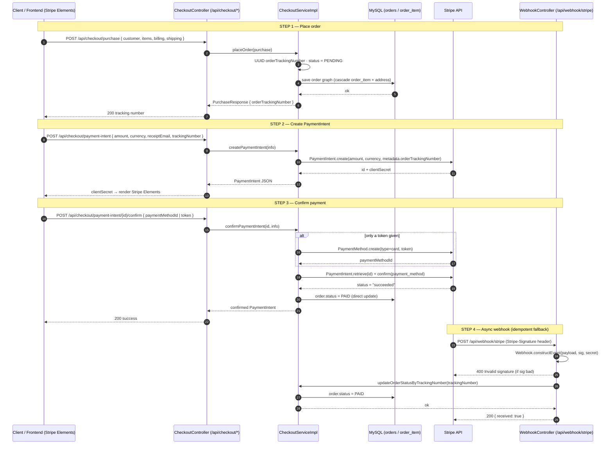
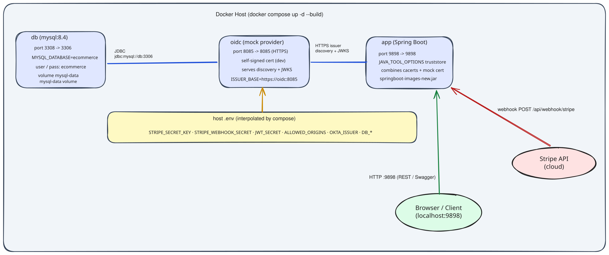

<div align="center">
  
</div>

<h1 align="center">🛍️ Spring Boot E-Commerce Backend System</h1>

<p align="center">
  A robust and scalable backend system for an E-Commerce platform built with <strong>Spring Boot</strong> and <strong>MySQL</strong>. Designed to handle product management, customer orders, authentication, and payment processing with modern best practices.
</p>

---

## 📚 Table of Contents

- [📖 Introduction](#-introduction)
- [✨ Features](#-features)
- [🧰 Technologies Used](#-technologies-used)
- [🏛️ Architecture](#-architecture)
- [⚙️ Installation](#-installation)
- [🚀 Usage](#-usage)
- [📘 API Documentation](#-api-documentation)

---

## 📖 Introduction

This backend system powers a modern e-commerce platform with core functionalities including:

- Secure user authentication and registration
- Product catalog and category management
- Shopping cart and order lifecycle handling
- Payment gateway integration with Stripe
- RESTful API support with Swagger documentation

Built for maintainability, security, and extensibility.

---

## ✨ Features

- 🔐 **Authentication** — local (JWT) and OAuth2 via Okta
- 👤 **`GET /api/auth/me`** — current user profile
- 📦 **Product & Category Management**
- 🛒 **Cart and Order Processing** with billing/shipping
- 💳 **Stripe Integration** for secure payments + webhook (`/api/webhook/stripe`) that marks orders as `PAID`
- 📘 **Interactive API Documentation** with Swagger UI
- 🧩 **Relational Entity Design** using JPA & Hibernate
- 🐳 **Docker Compose** — MySQL + app + dev mock OIDC
- 🧪 **Automated tests** (unit + integration, H2 test profile)

---

## 🧰 Technologies Used

- **Java 17** (Spring Boot 3)
- **MySQL** (Relational Database)
- **Spring Data JPA** (ORM)
- **Spring Security** (JWT + OAuth2/OIDC via Okta)
- **Swagger / OpenAPI 3** (API Testing & Docs)
- **Stripe** (Payments + webhook)
- **JUnit 5 + MockMvc** (tests, H2 in-memory)
- **Docker & Docker Compose** (local stack)

---

## 🏛️ Architecture

The system follows a layered architecture (see diagram below) — requests flow
**Client → Controller → Service → Repository → Entity → MySQL**, with
cross-cutting **Security**, **DTOs**, and **Config**, and two external
integrations (**Okta / mock OIDC** for identity, **Stripe** for payments):

- **Client**: SPA / mobile app consuming the REST API with a Bearer JWT.
- **Presentation Layer** — controllers: `AuthController`, `CheckoutController`,
  `WebhookController`, plus Spring Data REST endpoints (`/api/products`, ...).
- **Service Layer (Business Logic)** — `AuthService` (register / login / profile)
  and `CheckoutService` (placeOrder / PaymentIntent).
- **Data Access Layer (Spring Data JPA)** — `JpaRepository` interfaces
  (`AppUser`, `Order`, `Product`, ...) with derived queries
  (`findByEmail`, `findByOrderTrackingNumber`, ...).
- **JPA Entities** — `AppUser`, `Customer`, `Order`, `Product`, `Address`, ...
- **Data** — MySQL (`db` container, port 3306).
- **Security (cross-cutting)** — `SecurityFilterChain`, `JwtService` (HS256 local),
  dual `JwtDecoder` (HS256 + RS256 Okta), `BCryptPasswordEncoder`.
- **DTOs** — `AuthResponse`, `MeResponse`, `Purchase`, `PaymentInfo`, ...
- **Config** — `SecurityConfiguration`, `OpenApiConfig` (Swagger),
  `MyDataRestConfig`, `DataSeeder` (seed SQL).



### 📐 Diagrams

The Excalidraw diagrams are generated from the actual code
(`scripts/gen-diagrams.py`). Open any `.excalidraw` file with
[excalidraw.com](https://excalidraw.com) (File → Open) or the VSCode Excalidraw
extension:

| Diagram | File |
|---------|------|
| Layered architecture (Controller → Service → DAO → Entity → MySQL + Security/DTO/Config) | [`erd/architecture-layers.excalidraw`](erd/architecture-layers.excalidraw) |
| Entity Relationship (tables, PK/FK, cardinalities) | [`erd/ERD.excalidraw`](erd/ERD.excalidraw) |
| Docker Compose stack (db, oidc, app + host `.env`) | [`erd/docker-architecture.excalidraw`](erd/docker-architecture.excalidraw) |
| Auth flow: local JWT (HS256) + Okta/mock OIDC (RS256) | [`erd/okta-auth-flow.mmd`](erd/okta-auth-flow.mmd) |
| Stripe payment flow (purchase → PaymentIntent → webhook → PAID) | [`erd/stripe-payment-flow.mmd`](erd/stripe-payment-flow.mmd) |

Regenerate Excalidraw diagrams after code changes with
`python3 scripts/gen-diagrams.py`. The auth and Stripe flows below are Mermaid
(diagram source in `erd/*.mmd`, editable at [mermaid.live](https://mermaid.live)).

#### 🔑 Okta / Auth Flow (Mermaid)



#### 💳 Stripe Payment Flow (Mermaid)



### 🔗 Entity Relationships

- One **Customer** → Many **Orders**
- One **Order** → Many **OrderItems**
- One **Order** → One **Shipping Address** & One **Billing Address**
- One **Product** → One **ProductCategory**
- One **Country** → Many **States**

---

## ⚙️ Installation

### 📌 Prerequisites

- Java 17+
- Maven
- MySQL Server
- Okta Developer Account
- Stripe Developer Account

### 🧾 Setup Instructions

1. **Clone the Repository**
    ```bash
    git clone https://github.com/hendrowunga/spring-boot-ecommerce-backend.git
    cd spring-boot-ecommerce-backend
    ```

2. **Create `.env` File**  
   Copy example file and customize:
    ```bash
    cp .exampel.env .env
    ```

3. **Configure the `.env` File**  
   Update your credentials and configurations:
    ```env
    OKTA_CLIENT_ID=your-okta-client-id
    OKTA_ISSUER=https://your-okta-domain/oauth2/default

    DATABASE_URL=jdbc:mysql://localhost:3306/ecommerce
    DATABASE_USERNAME=root
    DATABASE_PASSWORD=password

    STRIPE_SECRET_KEY=your-stripe-secret
    STRIPE_WEBHOOK_SECRET=whsec_...   # optional locally, needed for webhook verification
    JWT_SECRET=your-random-jwt-secret
    ALLOWED_ORIGINS=http://localhost:3000
    ```

4. **Build the Project**
    ```bash
    mvn clean install
    ```

5. **Run the Application**
    ```bash
    mvn spring-boot:run
    ```

Once started, access the application at `http://localhost:9898`.

---

### 🐳 Running with Docker Compose (recommended)

The stack includes **MySQL**, the app, and a **dev-only mock OIDC server**
(`docker/oidc/`) that mimics Okta over HTTPS so the Okta flow works out of the box:

| Service | Image | Host port | Notes |
|---------|-------|-----------|-------|
| `db` | `mysql:8.4` | `3308 → 3306` | `MYSQL_DATABASE=ecommerce`, user/pass `ecommerce`, volume `mysql-data` |
| `oidc` | `python:3.12-slim` (build `./docker/oidc`) | `8085 → 8085` (HTTPS) | self-signed cert (dev), serves OIDC discovery + JWKS, `ISSUER_BASE=https://oidc:8085` |
| `app` | Spring Boot (build `.`) | `9898 → 9898` | truststore = cacerts + mock cert, runs `springboot-images-new.jar` |



The **app** talks to **db** over JDBC (`jdbc:mysql://db:3306/ecommerce`) and to
**oidc** over HTTPS (issuer discovery + JWKS). The **app** reads
`STRIPE_SECRET_KEY`, `STRIPE_WEBHOOK_SECRET`, `JWT_SECRET`, `ALLOWED_ORIGINS`,
`OKTA_ISSUER` and DB settings from the host `.env` (interpolated by compose).
The **browser** reaches the app via HTTP `:9898` (REST / Swagger), and **Stripe**
delivers webhooks to `POST /api/webhook/stripe`.

1. **Generate the mock OIDC self-signed cert** (gitignored, dev only):
    ```bash
    bash scripts/gen-oidc-cert.sh
    ```

2. **Start the stack**:
    ```bash
    docker compose up -d --build
    ```

   - App: http://localhost:9898 (Swagger: `/swagger-ui/index.html`)
   - MySQL: `127.0.0.1:3308` (user `ecommerce` / pass `ecommerce123`, db `ecommerce`)
   - Mock OIDC: https://localhost:8085 — get a test JWT with:
     `curl -sk "https://localhost:8085/oauth2/default/issue?email=you@example.com"`
   - Stripe API key / webhook secret / JWT secret are read from your `.env`.

3. **Stop**:
    ```bash
    docker compose down
    ```

> ⚠️ The mock OIDC is for local development only. For production, use a real Okta
> tenant and regenerate the truststore without the self-signed mock cert.

#### 🔐 Mock OIDC certificate & key (`docker/oidc/`)

`docker/oidc/` holds the dev mock OIDC provider:

| File | Purpose | Git |
|------|---------|-----|
| `mock_oidc.py` | HTTPS OIDC server (discovery, JWKS, token issuance) | ✔ committed |
| `Dockerfile` | `python:3.12-slim` + `cryptography` | ✔ committed |
| `cert.pem` / `key.pem` | self-signed cert + private key (SAN: `oidc`, `localhost`, `127.0.0.1`) | ✖ gitignored (dev only) |

The cert is required so the **app** container can call
`https://oidc:8085` (HTTPS issuer discovery). At image build time the cert is
imported into a combined truststore (`cacerts` + mock cert) via `keytool`, and
the app runs with `JAVA_TOOL_OPTIONS="-Djavax.net.ssl.trustStore=..."`.

Generate (skips automatically if the files already exist):

```bash
bash scripts/gen-oidc-cert.sh
```

Regenerate from scratch (e.g. cert expired or lost):

```bash
rm docker/oidc/cert.pem docker/oidc/key.pem
bash scripts/gen-oidc-cert.sh
```

Verify the generated cert:

```bash
openssl x509 -in docker/oidc/cert.pem -noout -subject -ext subjectAltName
# expect: subject=CN = mock-oidc
#         DNS:oidc, DNS:localhost, IP Address:127.0.0.1
```

> ⚠️ After regenerating, rebuild the images so the oidc container and the app's
> truststore use the new cert: `docker compose up -d --build`

---

### 🔄 Stripe Webhook (Local Development)

The endpoint `POST /api/webhook/stripe` verifies the Stripe signature (hex `v1=`)
and sets the matching order to `PAID` on `payment_intent.succeeded`.

1. Install the Stripe CLI: https://docs.stripe.com/stripe-cli
2. Authenticate: `stripe login` (opens browser)
3. Forward real webhooks to the app:
    ```bash
    bash scripts/stripe-listen.sh
    ```
   The CLI prints a **webhook signing secret** (`whsec_...`). Copy it into your
   `.env` as `STRIPE_WEBHOOK_SECRET` and restart the app.
4. Trigger a test event: `stripe trigger payment_intent.succeeded`

---

### 🧪 Running Tests

Tests use an in-memory H2 database (profile `test`), so no external services are needed:

```bash
mvn test
```

Covers: JWT encode/decode, auth service & controller, checkout + webhook flow, and security rules.

---

## 🚀 Usage

After running the app, you can interact with the system through:

- 🧪 **Swagger UI**: [http://localhost:9898/swagger-ui/index.html](http://localhost:9898/swagger-ui/index.html)
- 🔐 **Authentication**: Secure endpoints via Okta
- 🛍️ **Product APIs**: View, add, and manage products
- 📦 **Order APIs**: Place and manage customer orders

### 📡 Sample Endpoints

| Method | Endpoint | Description |
|--------|----------|-------------|
| `POST` | `/api/auth/register` | Register a local user (returns JWT) |
| `POST` | `/api/auth/login`    | Login (returns JWT) |
| `GET`  | `/api/auth/me`       | Current user profile (Bearer token) |
| `GET`  | `/api/products`      | Fetch product catalog |
| `POST` | `/api/checkout/purchase` | Create order + Stripe payment intent |
| `POST` | `/api/webhook/stripe` | Stripe event handler (verifies signature) |
| `GET`  | `/api/orders`        | List current user's orders (Bearer token) |

---

## 📘 API Documentation

Swagger UI provides a clean interface to test all APIs:

<div align="center">
  
</div>
<div align="center">
  
</div><div align="center">
  
</div>

🔗 Open in browser:  
[http://localhost:9898/swagger-ui/index.html](http://localhost:9898/swagger-ui/index.html)

---

## 📸 Sample Stripe Dashboard

### 🧾 Stripe Dashboard – Transactions View

The following image displays the **Stripe dashboard's transactions list**, where merchants can view the status and details of all payments processed through the system. For a successful test transaction, it shows key details such as:

- **Amount**: The total amount paid by the customer (e.g., US$85.95).
- **Status**: Confirmation of a successful payment (e.g., "Succeeded ✅").
- **Payment Method**: The card type and last four digits (e.g., Visa ending in 4242).
- **Description**: Details of the purchase (e.g., "Hen Store - Purchase").
- **Customer**: The customer's email address (e.g., `wungambara@gmail.com`).
- **Date**: The timestamp of the transaction.

<div align="center">
  
</div>

---

### 📧 Stripe Receipt Email – Example from Sandbox

Below is a sample email automatically sent by **Stripe** to the customer as a payment receipt after a successful transaction. This example is from the Stripe sandbox environment.

🧾 **Receipt #1077-4343**

- 💵 **Amount paid**: $85.95
- 🕒 **Date paid**: Jun 6, 2025, 8:38:46 AM
- 💳 **Payment method**: Visa ending in 4242

#### 💼 Summary:
- Hen Store - Purchase: **$85.95**
- **Amount paid**: **$85.95**

The email also provides a contact point for customer inquiries (e.g., `wungambara@gmail.com`).

<div align="center">
  
</div>

---

## 📄 License

**All Rights Reserved.**

This project and its source code are the exclusive property of the copyright
holder. No permission is granted to copy, modify, distribute, or use the code
without prior written consent. See the [LICENSE](LICENSE) file for details.

Copyright © 2026 Hendrowunga

---

<div align="center">
  <p>Thank You</p>
</div>
